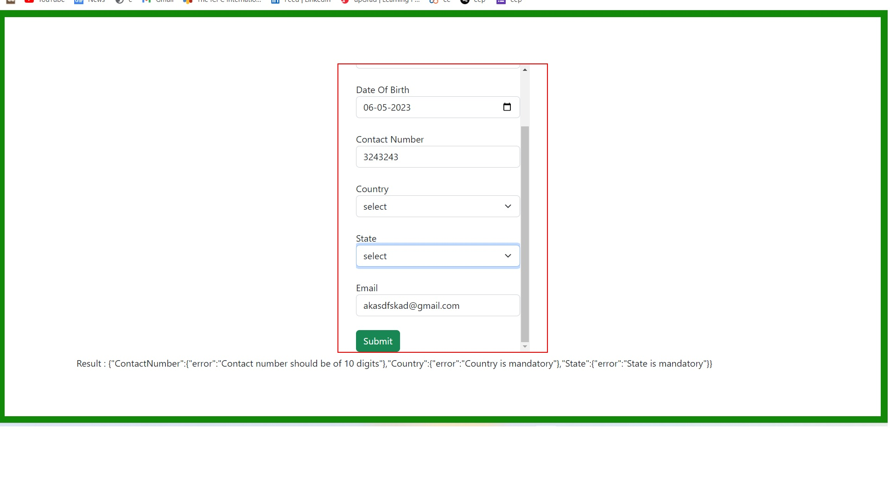

# Netomi_assignment.io
Label-blue

<h1>link of site demo :https://akash-deep-das.github.io/Netomi_assignment.io</h1>

save -files and run index file here 
a form as shown in the image below. The form needs to be loaded in the iframe. 
•	The form will have fields like Name, Email address, Contact number, Country and State. 
•	Country and state are drop-down, countries are pre-populated via an API call. If a country is selected, only the states of the selected country should be populated in the state dropdown. Refer to this URL for countries and states (API call is recommended don’t hardcode the JSON)
url:https://raw.githubusercontent.com/stefanbinder/countries-states/master/countries.json for api country & states

and added these validations in the form fields: 
o	Name -  Length should be between 4-10 characters.
o	Email address - should only support valid email address 
o	Contact number - mobile number should be of 10 digits.
o	Country, State, Name - are mandatory fields.
•	If all fields are valid, show the success message “All fields are valid” on the parent window or the error message as shown in the image.

## Technologies

&nbsp;

&nbsp;

&nbsp;

&nbsp;

---
<h1>image of assignment</h1>

link of site demo :https://akash-deep-das.github.io/Netomi_assignment.io/

